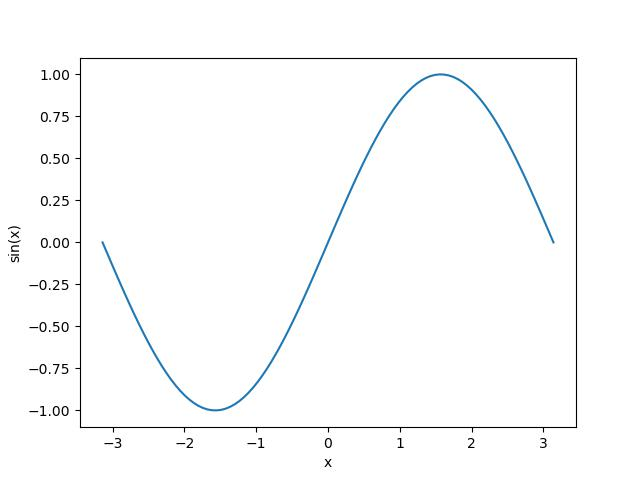
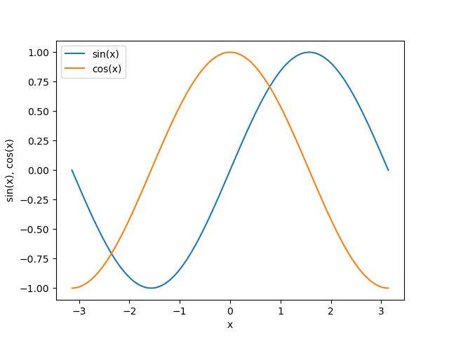
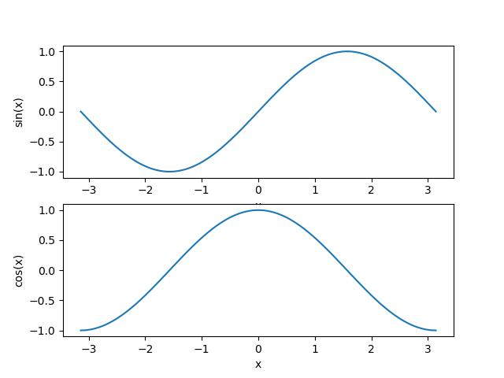
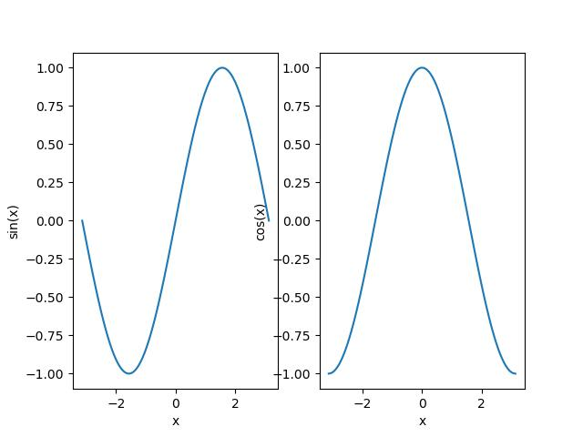

# 描画
## Matplotlib
Pythonでは，グラフなどの描画にライブラリmatplotlibを使うのが標準的である．書籍やインターネット上に多数の解説が
あるので，活用すると良い．以下に簡単な例を示す．

### 折れ線グラフ
```
import numpy as np
import matplotlib.pyplot as plt

x = np.linspace(-np.pi,np.pi,100)
y = np.sin(x)

fig = plt.figure()

ax = fig.add_subplot(1, 1, 1)
plt.plot(x,y)
plt.xlabel('x')
plt.ylabel('sin(x)')

plt.savefig('plot_sample1.pdf')
plt.show()
```


```
import numpy as np
import matplotlib.pyplot as plt

x = np.linspace(-np.pi,np.pi,100)
y = np.sin(x)
z = np.cos(x)

fig = plt.figure()

ax = fig.add_subplot(1, 1, 1)
plt.plot(x, y, label='sin(x)')
plt.plot(x, z, label='cos(x)')
plt.xlabel('x')
plt.ylabel('sin(x), cos(x)')
ax.legend()

plt.savefig("plot_sample2.pdf")
plt.show()
```


```
import numpy as np
import matplotlib.pyplot as plt

x = np.linspace(-np.pi,np.pi,100)
y = np.sin(x)
z = np.cos(x)

fig = plt.figure()

ax1 = fig.add_subplot(2, 1, 1)
plt.plot(x,y)
plt.xlabel('x')
plt.ylabel('sin(x)')

ax2 = fig.add_subplot(2, 1, 2)
plt.plot(x,z)
plt.xlabel('x')
plt.ylabel('cos(x)')

plt.savefig("plot_sample3.pdf")
plt.show()
```


```
import numpy as np
import matplotlib.pyplot as plt

x = np.linspace(-np.pi,np.pi,100)
y = np.sin(x)
z = np.cos(x)

fig = plt.figure()

ax1 = fig.add_subplot(1, 2, 1)
plt.plot(x,y)
plt.xlabel('x')
plt.ylabel('sin(x)')

ax2 = fig.add_subplot(1, 2, 2)
plt.plot(x,z)
plt.xlabel('x')
plt.ylabel('cos(x)')

plt.savefig("plot_sample4.jpg")
plt.show()
```

